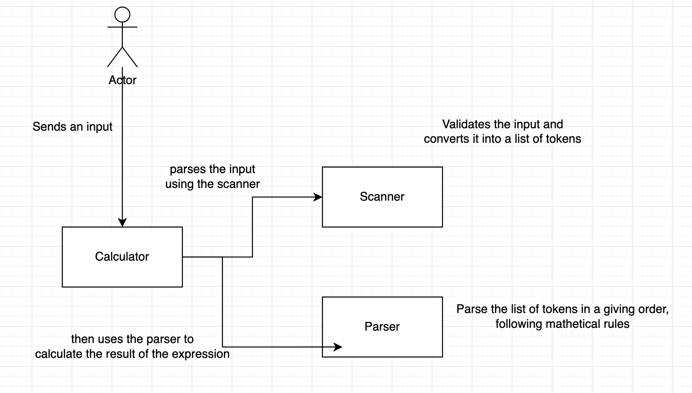
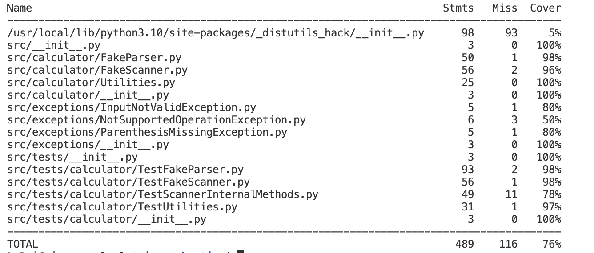

# Calculatrice

Minimalistic calculator implemented in Python.

## Table Of Contents

- [How does it work](#how-does-it-work)
    - [How to use it from the terminal](#how-to-use-it-from-the-terminal)
    - [How to use it using the GUI](#how-to-use-it-using-the-gui)
    - [Specifications](#specifications)
    - [Architecture](#architecture)
- [Testing](#testing)
    - [Test Driven Development](#test-driven-development)
    - [Unit Tests](#unit-tests)
    - [Code Coverage](#code-coverage)
    - [Testing The Ui](#testing-the-ui)
    - [Testing The Database](#testing-the-database)
    - [A Word About Mutation Testing and Other Problems](#a-word-about-mutation-testing-and-other-problems)

# How does it work
## How to use it from the terminal

Create a `Calculator` object like:

```python
from src.calculator.Calculator import Calculator


calculator = Calculator()

calculator.calculate('5 + 5')
calculator.calculate('5 + ( 2 / ( 3 + ( 7 * 1 ) ) ) + 1')
calculator.calculate('5 + 5 - -9.1 + 9.9')
calculator.calculate('-5 + 5')
```

The calculator respects the parenthesis order and accepts leading negative numbers!

## How to use it using the GUI

Two UI were implemented.

The first one is a graphic UI using `Tkinter`. To use it, simply execute the Playground without any argument. This UI is tested by using classic assertions testing by testing all the functions called by the events when clicking on an button.

**Warning :** On the last versions of MacOS, install the last version of Python 3.10 and use `/usr/local/bin/python3.10 PlayGround.py` to avoid graphical bugs with the version of Tkinter available on the pre-installed MacOS version of Python.

The second one is a web UI. Simply start the server with web on the argument like ```python3 PlayGround.py web``` and connect on the following adress : ```http://localhost:8000```.

## Specifications

For the moment, the calculator

- does not respects the multiplication/division precedence rule. That means that does not execute first the multiplication and division. `1 + 1 * 5` will return `10` instead of `6`.
- You need to put an space after each character. For example: This is a valid expression: `5 + 7 + ( 4 / 3 )` but  `5 + 7 + (4 / 3)` it's not valid for our scanner because the space after and before the parenthesis are missing!

We may add in the future support for:

- Respecting the multiplication/division precedence rule.
- Not putting spaces after (or before) the parenthesis
- Support mathematical constants like `pi` and `e` (we need to modify the scanner and the parser)
- Adding operators that only accept one argument, for example `sin`, `cos`, `tan`, or `sqrt` (we need to modify the scanner and the parser)
- Adding support for other roots, not only the square

## Architecture

This is our, minimalistic, architecture. We took the idea of the designing of compilers! But we have a fake Parser and a fake Scanner :P

The user can send the input from a GUI, or also directly as a string from the terminal.



# Testing

## Test Driven Development

When we implemented our calculator using test driven development. So, we first wrote the tests and incrementally we were adding functionalities. This approach helped us a lot because we know what we were expecting from the `FakeScanner` and from the `FakeParser` but at the beginning we were not very clear in how we can implement.

## Unit Tests

You can run the unit tests for the classes inside the `src/calculator` directory using the script 

```bash
$ sh run_calculator_logic_tests.sh
```

For running the unit tests for the database, you can use the script

```bash
$ sh run_database_tests.sh
```

## Code coverage

With the script

```bash
$ sh run_calculator_logic_tests.sh
```

You will also see the code coverage of the logic of our application. We will only consider this part for the coverage analysis because we consider that this is the core of our project. The rest of our code is to use a database and to have a user interface. This is also important in an application. But in our case, the database code is just a protype and the user interface have its own tests (see section [Testing the UI](#testing-the-ui)).

So, if you run the script you will see the following output:



- The output is for a class that is a file that is outside our project so the 5% is not important.
- After we see that all the outputs are above 96% of test coverage, except for the exceptions. This is also not important, because if we see the code of our custom exception they only raise an exception with a custom message. **We test that the exceptions are risen**
- From the line `src/tests/*` the files represent **only** testing file. It does not make sense to measure the test coverage of a test file. So, we it's not important for us if the coverage is high or low for the tests.

So, the important is that the core of our code (the calculator, parser and scanner) are well tested and have a good test coverage. Our classes are above 96% of test coverage.

## Testing the UI

To simplify, we've made a short video named UI Testing Demo on the repo to show you Selenium working and the Tkinter UI.

To test the web UI yourself, we used Selenium. You can use the script on the file named ```TestServerInterface.py```. Before, you have to install Google Chrome version 106 on your computer (for MacOS, the installator of this specific version is on the repo in the webdrivers folder) and you have to change line 6 the ```webdriver.Chrome``` to point the driver corresponding to your OS. All the drivers are in the webdrivers folder. You have to install Selenium using PIP.

To test the Tkinter UI yourself, we wrote a test class named ```TestUserInterface```. This class use ```unittest```to call all the methods linked to the UI button and test the answer written on the screen.

## Testing the Database

For this part, we implemented a unit test class which test CRUD operation. Our main goal was to add a database to save and print previous calculs. In the beginning, we thought to develop a CSV file to save the calcul and use the program to make differential testing with the database, however we noticed that this the job of H2 developper to test this part of programs. We correct the problem for dirty database. 

For testing this part, execute the ```sh run_database_tests.sh``` and it will execute all the test

## A Word About Mutation Testing and Other Problems

We tried to use two Python libraries for the mutation testing. We don't know why, but we were always getting that all of the mutants survived. Which is not true. We confirm this applying by hand one mutation and see if the tests are passing, which is not true. You can try yourself with the command `mutmut run`. We have already a configuration file for `mutmut`. See `setup.cfg`

Moreover, we tried to test the bad cases (the exceptions raised from the scanner or ther parser) for the user interface in: `serverInterface` however we had some problems .

